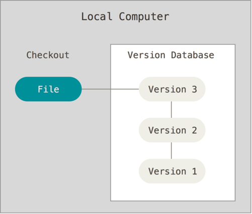
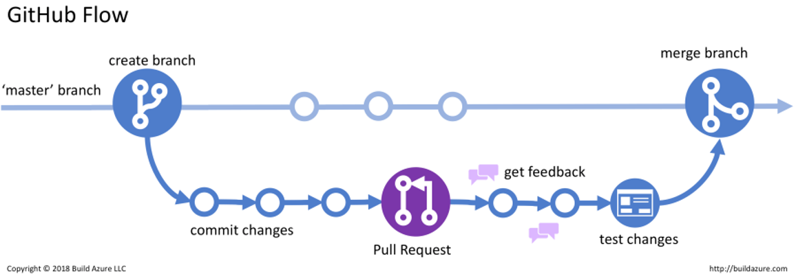

# Github_tutorial  
  
미노리랩 **깃헙 튜토리얼**에 오신 여러분을 환영합니다!  
여러분은 이 튜토리얼을 통해 clone, push, pull, branch 만들기, merge 등을 경험할 수 있습니다.  

## What is Git?  
- Distributed Version Control System (DVCS)
- 분산버전관리 시스템
- 여러 개발자가 하나의 소프트웨어 개발 프로젝트에 참여할 때 소스코드를 관리하기 위해 사용

## 버전관리란?

- 하나의 소스코드에 대해 버전을 지속적으로 업데이트하며 쓸 수 있는 기능  
- git을 이용해 소스코드 버전 관리를 지속적으로 가능케 함  

## 협업과 branch

- Master(혹은 main)에서 뻗어나온 가지, 분기점을 branch라고 일컫음  
- 각자의 branch에서 개발 후 test를 거쳐 merge를 진행함  

## Git 기본 용어
- **Repository (레포지토리, 저장소)** : 모든 소스코드의 저장소
- **Working Tree** : 작업자의 현재 시점 (version 몇을 보고있는지)
- **Staging Area** : commit 전 변경사항이 저장되어있는 커밋 준비 장소
- **Commit** : 저장소에 올리는 작업
- **Branch** : 분기점. 현 상태를 복사하여 작업 후, master branch에 합침
- **Merge** : branch를 합치는 것

## git 명령어
- 현재 상태 확인 `git status`  
- 전체 로그 확인 `git log git`  
- 저장소 생성하기 `git init`  
저장소 복제 및 다운로드 `git clone [https: ~~~~ ]` 저장소에 코드 추가
git addgit add * 커밋에 파일의 변경 사항을 한번에 모두 포함  git add -A 커밋 생성git commit -m "message" 변경 사항 원격 서버 업로드 (push)git push origin master 원격 저장소의 변경 내용을 현재 디렉토리로 가져오기 (pull)git pull 변경 내용을 merge 하기 전에 바뀐 내용 비교git diff [브랜치 이름] [다른 브랜치 이름]        Git Branch 관련 (생성, 브랜치 확인, push 까지의 과정 포함) git init을 설정하면 해당 폴더에 .git 이라는 파일이 생성됨 git init github 주소와 연결 git remote add origin [github 주소] 브랜치 생성git branch [브랜치명] 해당 브랜치로 이동git checkout [브랜치명] 브랜치를 생성하고 해당 브랜치로 바로 이동git branch -b [브랜치명] 원하는 브랜치로 이동했는지 확인 git branch 모든 브랜치 확인 git brach -a 파일 및 폴더 addgit add . 커밋 git commit -m "commit message" 원하는 브랜치로 push하여 원격 서버에 전송 git push origin [브랜치명] 브랜치 삭제 git branch -d [브랜치 이름] 현재 브랜치에 다른 브랜치 수정사항 병합git merge [다른 브랜치 이름]
출처: https://eehoeskrap.tistory.com/666 [Enough is not enough:티스토리]